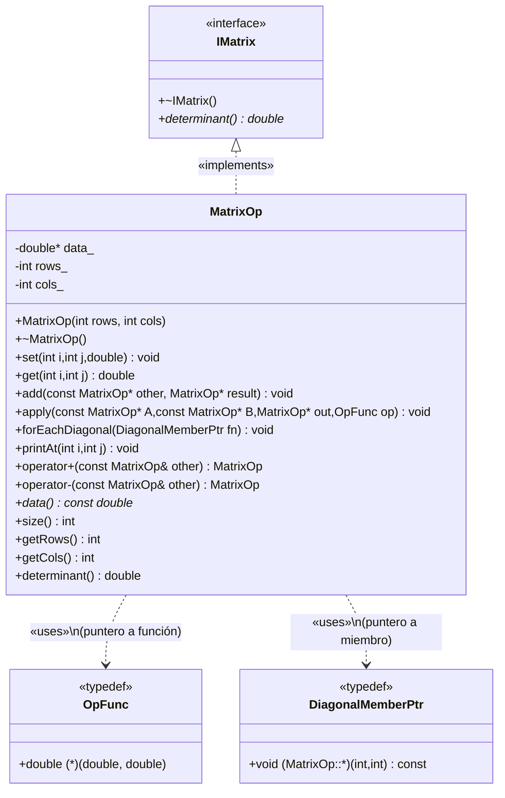

# Diagrama de clases

```mermaid
classDiagram
    %% ─────────────────────────────────────────────────────────────
    %%  Definiciones de tipos auxiliares usados por MatrixOp
    %% ─────────────────────────────────────────────────────────────
    class OpFunc {
        <<typedef>>
        +double (*)(double, double)
    }

    %% Se muestra explícitamente para documentar el uso de puntero a miembro
    class DiagonalMemberPtr {
        <<typedef>>
        +void (MatrixOp::*)(int,int) const
    }

    %% ─────────────────────────────────────────────────────────────
    %%  Interfaz abstracta
    %% ─────────────────────────────────────────────────────────────
    class IMatrix {
        <<interface>>
        +~IMatrix()
        +determinant() double*
    }

    %% ─────────────────────────────────────────────────────────────
    %%  Implementación concreta
    %% ─────────────────────────────────────────────────────────────
    class MatrixOp {
        -double* data_
        -int     rows_
        -int     cols_

        %% ――― Constructores / destructores ―――
        +MatrixOp(int rows, int cols)
        +~MatrixOp()

        %% ――― A1: getters, setters ―――
        +set(int i,int j,double) void
        +get(int i,int j) double

        %% ――― A2: suma por punteros ―――
        +add(const MatrixOp* other, MatrixOp* result) void

        %% ――― A3: operación genérica por OpFunc ―――
        +apply(const MatrixOp* A,const MatrixOp* B,MatrixOp* out,OpFunc op) void

        %% ――― A4: recorrido diagonal por puntero a miembro ―――
        +forEachDiagonal(DiagonalMemberPtr fn) void
        +printAt(int i,int j) void

        %% ――― B1: sobrecarga de operadores ―――
        +operator+(const MatrixOp& other) MatrixOp
        +operator-(const MatrixOp& other) MatrixOp

        %% ――― B2: utilidades expuestas ―――
        +data() const double*
        +size() int
        +getRows() int
        +getCols() int

        %% ――― B3: implementación del virtual ―――
        +determinant() double
    }

    %% ─────────────────────────────────────────────────────────────
    %%  Relaciones
    %% ─────────────────────────────────────────────────────────────
    IMatrix <|.. MatrixOp           : «implements»
    MatrixOp ..> OpFunc            : «uses»\n(puntero a función)
    MatrixOp ..> DiagonalMemberPtr : «uses»\n(puntero a miembro)
```
